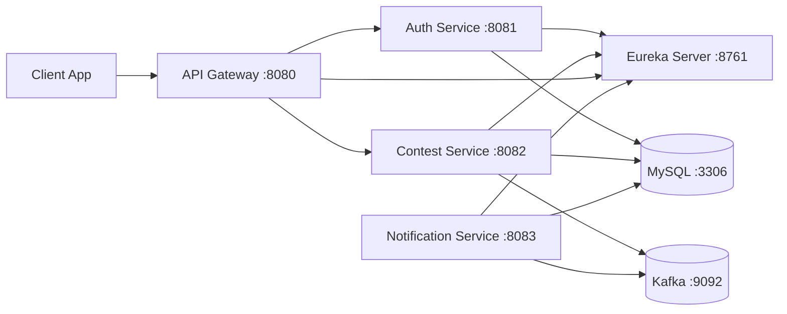

# ContestTracker Backend

ContestTracker is a Spring Boot microservices backend for contest tracking and user notifications.

This repository includes:
- Service discovery with Eureka
- API gateway routing with Spring Cloud Gateway
- Authentication service
- Contest service
- Notification service
- MySQL for persistence
- Kafka for event messaging

## Project Structure

```text
backend/
  docker-compose.yml
  eureka/
  gateway/
  com/                  # auth-service
  contest/
  notification-service/
```

## Architecture



## Tech Stack

- Java 21 (Docker image runtime)
- Spring Boot and Spring Cloud Netflix
- Spring Cloud Gateway
- Spring Data JPA
- MySQL 8
- Apache Kafka 3.8.0
- Docker Compose

## Quick Start (Docker)

### 1. Prerequisites

- Docker Desktop running
- Java and Maven wrapper available for building jars (`mvnw.cmd` is included per service)

### 2. Build all service jars

Run from `backend` in PowerShell:

```powershell
$services = @("eureka", "gateway", "com", "contest", "notification-service")
foreach ($s in $services) {
  Push-Location $s
  .\mvnw.cmd -DskipTests clean package
  Pop-Location
}
```

### 3. Start the system

```bash
docker compose up --build
```

### 4. Stop the system

```bash
docker compose down
```

## Service URLs

- API Gateway: `http://localhost:8080`
- Eureka Dashboard: `http://localhost:8761`
- Auth Service (direct): `http://localhost:8081`
- Contest Service (direct): `http://localhost:8082`
- Notification Service (direct): `http://localhost:8083`

Use gateway URLs for normal client access.

## API Endpoints (via Gateway)

### Auth

- `POST /auth/register`
- `POST /auth/login`

Example:

```bash
curl -X POST http://localhost:8080/auth/register \
  -H "Content-Type: application/json" \
  -d '{"email":"user@example.com","password":"secret123"}'
```

```bash
curl -X POST http://localhost:8080/auth/login \
  -H "Content-Type: application/json" \
  -d '{"email":"user@example.com","password":"secret123"}'
```

### Contest

- `GET /contests`
- `POST /contests/test`

Example:

```bash
curl http://localhost:8080/contests
```

```bash
curl -X POST http://localhost:8080/contests/test
```

## Configuration Notes

- Docker Compose provides container-friendly values for service discovery and database URLs.
- If you change `gateway/src/main/resources/application.properties`, rebuild the gateway jar before rebuilding Docker images.
- Credentials and mail settings are currently configured for local development. Move sensitive values to environment variables before sharing or deploying.

## Troubleshooting

- `docker compose up` fails immediately:
  - Ensure Docker Desktop engine is running.
- Gateway can reach auth but not contest:
  - Verify gateway routes point to `lb://CONTEST-SERVICE`.
  - Rebuild gateway jar and restart container.
- Services start but routing returns `503`:
  - Wait for Eureka registration.
  - Restart gateway after Eureka is fully up.
- Build errors during Docker image creation:
  - Re-run service jar builds and confirm `target/*.jar` exists in each module.

## Development Workflow

1. Make code changes in a service module.
2. Rebuild that module jar with `mvnw.cmd -DskipTests clean package`.
3. Rebuild only the affected container, for example:

```bash
docker compose up -d --build api-gateway
```

4. Validate through gateway endpoints.

## License

Add your preferred license information here.
