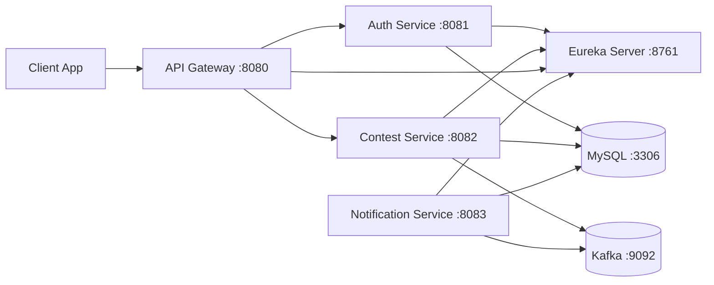

# ContestTracker Backend

ContestTracker is a Spring Boot microservices backend for contest tracking and user notifications.

This repository includes:
- Service discovery with Eureka
- API gateway routing with Spring Cloud Gateway
- Authentication service
- Contest service
- Notification service
- MySQL for persistence
- Kafka for event messaging

## Project Structure

```text
backend/
  docker-compose.yml
  eureka/
  gateway/
  com/                  # auth-service
  contest/
  notification-service/
```

## Architecture



## Tech Stack

- Java 21 (Docker image runtime)
- Spring Boot and Spring Cloud Netflix
- Spring Cloud Gateway
- Spring Data JPA
- MySQL 8
- Apache Kafka 3.8.0
- Docker Compose

## Quick Start (Docker)

### 1. Prerequisites

- Docker Desktop running
- Java and Maven wrapper available for building jars (`mvnw.cmd` is included per service)

### 2. Build all service jars

Run from `backend` in PowerShell:

```powershell
$services = @("eureka", "gateway", "com", "contest", "notification-service")
foreach ($s in $services) {
  Push-Location $s
  .\mvnw.cmd -DskipTests clean package
  Pop-Location
}
```

### 3. Start the system

```bash
docker compose up --build
```

### 4. Stop the system

```bash
docker compose down
```

## Service URLs

- API Gateway: `http://localhost:8080`
- Eureka Dashboard: `http://localhost:8761`
- Auth Service (direct): `http://localhost:8081`
- Contest Service (direct): `http://localhost:8082`
- Notification Service (direct): `http://localhost:8083`

Use gateway URLs for normal client access.

## API Endpoints (via Gateway)

### Auth

- `POST /auth/register`
- `POST /auth/login`

Example:

```bash
curl -X POST http://localhost:8080/auth/register \
  -H "Content-Type: application/json" \
  -d '{"email":"user@example.com","password":"secret123"}'
```

```bash
curl -X POST http://localhost:8080/auth/login \
  -H "Content-Type: application/json" \
  -d '{"email":"user@example.com","password":"secret123"}'
```

### Contest

- `GET /contests`
- `POST /contests/test`

Example:

```bash
curl http://localhost:8080/contests
```

```bash
curl -X POST http://localhost:8080/contests/test
```

## Configuration Notes

- Docker Compose provides container-friendly values for service discovery and database URLs.
- If you change `gateway/src/main/resources/application.properties`, rebuild the gateway jar before rebuilding Docker images.
- Credentials and mail settings are currently configured for local development. Move sensitive values to environment variables before sharing or deploying.

## Troubleshooting

- `docker compose up` fails immediately:
  - Ensure Docker Desktop engine is running.
- Gateway can reach auth but not contest:
  - Verify gateway routes point to `lb://CONTEST-SERVICE`.
  - Rebuild gateway jar and restart container.
- Services start but routing returns `503`:
  - Wait for Eureka registration.
  - Restart gateway after Eureka is fully up.
- Build errors during Docker image creation:
  - Re-run service jar builds and confirm `target/*.jar` exists in each module.

## Contest Service Workflow

The contest service has two responsibilities: keeping the contest database up to date by polling the Codeforces API, and sending reminder events over Kafka when a contest is about to start.

### 1. Scheduled Codeforces Sync (every 1 hour)

`ContestScheduler` runs `CodeforcesService.fetchContests()` every hour via `@Scheduled(fixedRate = 3600000)`.

`CodeforcesService` does the following:
1. Calls `GET https://codeforces.com/api/contest.list` using Spring's `RestTemplate`.
2. Iterates through the response list and **skips any contest whose `phase` is not `BEFORE`** — only upcoming contests are persisted.
3. For each upcoming contest, builds a `Contest` entity:
   - `title` → contest name from the API
   - `url` → `https://codeforces.com/contest/{id}`
   - `startTime` → converted from Unix epoch seconds to `LocalDateTime` (UTC)
   - `reminderSent` → `false`
4. Saves each contest to `contestdb` via `ContestRepository` (Spring Data JPA).

### 2. Scheduled Reminder Check (every 1 minute)

`ContestScheduler` also runs `sendReminders()` every minute via `@Scheduled(fixedRate = 60000)`.

For each contest it:
1. Loads all contests from the database.
2. Checks: `reminderSent == false` **AND** `startTime` is within the next 30 minutes (`isAfter(now)` and `isBefore(now + 30 min)`).
3. If the window matches, publishes a message to the Kafka topic **`contest-reminder`**:
   ```
   "Reminder: <contest title>"
   ```
4. Sets `reminderSent = true` and saves the contest — so each contest only triggers one reminder.

### 3. REST Endpoints

| Method | Path | Description |
|--------|------|-------------|
| `GET` | `/contests` | Returns all stored contests |
| `POST` | `/contests/test` | Creates a test contest starting 5 minutes from now (useful for testing the reminder pipeline) |

---

## Notification Service Workflow

The notification service is a pure event consumer — it has no REST endpoints. It listens on two Kafka topics and sends emails via Gmail SMTP.

### Topic 1: `user-registered`

**Published by:** Auth Service — after a user successfully registers, `AuthService` calls:
```java
kafkaTemplate.send("user-registered", email);
```

**Consumed by:** `UserRegisteredListener` (`@KafkaListener(topics = "user-registered")`)

Steps:
1. Receives the user's email address as the message payload.
2. Creates an `AppUser` entity and saves it to `notificationdb` — this is the notification service's own copy of registered users, used later to broadcast reminders.
3. Calls `EmailService.sendEmail(email)` to send a welcome email.

### Topic 2: `contest-reminder`

**Published by:** Contest Service scheduler (every minute, when a contest is within 30 minutes of starting).

**Consumed by:** `ContestReminderListener` (`@KafkaListener(topics = "contest-reminder")`)

Steps:
1. Receives the reminder string (e.g. `"Reminder: Codeforces Round 999"`) as the message payload.
2. Fetches **all users** from `notificationdb` via `UserRepository`.
3. Calls `EmailService.sendReminderEmail(email, message)` for **every registered user** — everyone gets notified.

### How the Emails Are Sent

`EmailService` uses Spring's `JavaMailSender`, configured with the Gmail SMTP settings in `notification-service/src/main/resources/application.properties`:

```properties
spring.mail.host=smtp.gmail.com
spring.mail.port=587
spring.mail.username=klshtestingproject@gmail.com
spring.mail.password=<app-password>
spring.mail.properties.mail.smtp.auth=true
spring.mail.properties.mail.smtp.starttls.enable=true
```

**Welcome email** (sent on registration):
- **To:** the newly registered user's email
- **Subject:** `Welcome to Contest Tracker 🚀`
- **Body:** `You have successfully registered to Contest Tracker.`

**Reminder email** (sent when a contest is within 30 minutes):
- **To:** every user in `notificationdb`
- **Subject:** `Contest Reminder 🚀`
- **Body:** the raw reminder string, e.g. `Reminder: Codeforces Round 999`

Both email types use `SimpleMailMessage`, which sends plain-text emails via `JavaMailSender.send()`.

> Note: The Gmail account must have an [App Password](https://myaccount.google.com/apppasswords) configured (not the regular account password) because Google blocks plain password auth for SMTP.

---

## Development Workflow

1. Make code changes in a service module.
2. Rebuild that module jar with `mvnw.cmd -DskipTests clean package`.
3. Rebuild only the affected container, for example:

```bash
docker compose up -d --build api-gateway
```

4. Validate through gateway endpoints.
